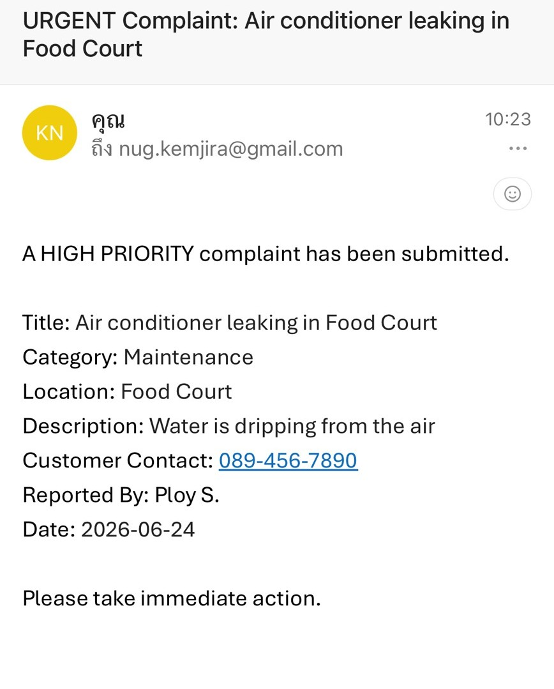

# Customer Complaint Tracker

A Power Apps canvas app integrated with SharePoint and Power Automate to streamline customer complaint management in retail environments.


## Features

* Log customer complaints through Power Apps
* Track complaints by status (New, In Progress, Resolved)
* Automatic email notifications with Power Automate
* Real-time dashboard with complaint statistics

## Tech Stack

* **Microsoft Power Apps (Canvas App)**
* **SharePoint Lists**
* **Power Automate**

## Workflow

```text
Customer Report
      ↓
Power Apps Form
      ↓
SharePoint List
      ↓
Power Automate Notification
      ↓
Status Update
      ↓
Resolution Email
```

## Application Preview

### Log Complaint Screen

<p align="center">
  
</p>

<p align="center">
Users can submit customer complaints by entering customer information, selecting a category, and describing the issue.
</p>

---

### Track Complaint Screen

<p align="center">
  
</p>

<p align="center">
Displays all complaints with status indicators, allowing users to monitor progress and search records efficiently.
</p>

---

### Complaint Detail Screen

<p align="center">
  
</p>

<p align="center">
Provides detailed information about each complaint, including customer data, category, and current status.
</p>

---

### Edit Complaint Screen

<p align="center">
  
</p>

<p align="center">
Authorized users can update complaint information and change the status as issues are being processed.
</p>

---

### Dashboard

<p align="center">
  
</p>

<p align="center">
Visual dashboard showing complaint statistics and status distribution in real time.
</p>

---

### Power Automate Flow

<p align="center">
  
</p>

<p align="center">
Power Automate workflow that automatically sends email notifications when new complaints are submitted.
</p>

---

### Email Notification

<p align="center">
  
</p>

<p align="center">
Automated email notification sent via Power Automate to notify the assigned team when a new complaint is submitted.
</p>

## Key Learnings

* Connecting Power Apps with SharePoint Lists
* Using `Patch()` and `SubmitForm()`
* Building Power Automate workflows for email notifications
* Creating real-time dashboards and status tracking
* Designing user-friendly forms and interfaces
