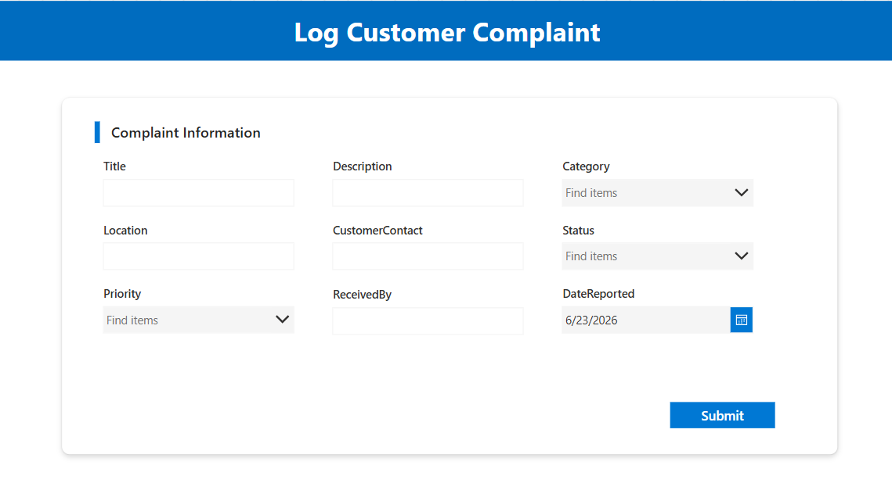

# Customer Complaint Tracker

A Power Apps canvas app integrated with SharePoint and Power Automate to streamline customer complaint management in retail environments.

## Features

* Log customer complaints through Power Apps
* Track complaints by status (New, In Progress, Resolved)
* Automatic email notifications with Power Automate
* Real-time dashboard with complaint statistics

## Tech Stack

* **Microsoft Power Apps (Canvas App)**
* **SharePoint List**
* **Power Automate**

## Workflow

```text
Customer Report
      ↓
Power Apps Form
      ↓
SharePoint List
      ↓
Power Automate Notification
      ↓
Status Update
      ↓
Resolution Email
```

## Application Preview

### Log Complaint Screen



### Track Complaint Screen


### Dashboard


### Power Automate Flow


##  Learnings

* Connecting Power Apps with SharePoint
* Using `Patch()` and `SubmitForm()`
* Creating Power Automate workflows
* Developing dashboards with real-time data
