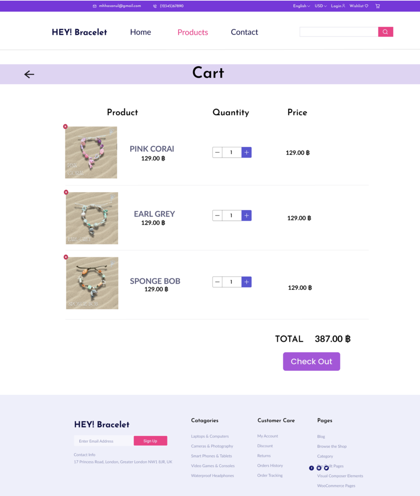

## HEY! Bracelet E-Commerce Platform
*(System Analysis & Prototype Project)*

📅 Duration: 02/2025 – 04/2025  

---

### Overview  
HEY! Bracelet is an e-commerce platform designed to provide personalized gift experiences through customizable bracelets and AI-generated stories.  
The system supports product customization, online shopping, and order management while promoting sustainability through recycled materials.

---

### Prototype  

🔗 Interactive Prototype (Figma): https://www.figma.com/proto/ZDkvN2DLASLbqp4rDQ6AUU/Project---Ecom--An-Ecommerce-Ui-Kit---Community-?node-id=791-7548  

  

  <em>Shopping cart interface showing product selection, quantity adjustment, and checkout flow</em>

---

### Key Features  
- Designed an e-commerce workflow including product browsing, cart, and checkout  
- Developed a prototype for personalized product customization and AI-generated stories  
- Modeled system interactions for user accounts, orders, and inventory  
- Improved user experience through structured navigation and interface design  

---

### System Roles  
- **Users:** Browse products, customize bracelets, and place orders  
- **Admin:** Manage products, orders, and user accounts  
- **Warehouse Staff:** Handle inventory and stock updates  
- **Suppliers:** Provide materials for production  

---

### Technical Details  
- Designed system workflows for order management and personalization  
- Structured data flow between users, orders, and inventory  
- Applied system analysis concepts (requirement analysis, process modeling)  
- Created prototype using Figma for interaction visualization  

---

### Tools Used  
- Figma  
- System Analysis & Design  
- Workflow Modeling  

---

### Project Structure  
- Prototype (Figma)  
- System documentation  
- Workflow diagrams  
