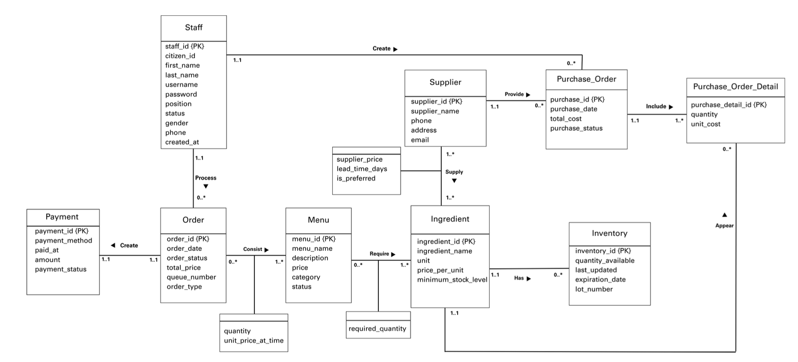

## Restaurant Inventory Management Database
*(Data Analysis & Database Design Project)*

📅 Duration: 01/2026 – Present  

---

### Overview  
This project focuses on designing and implementing a relational database system for managing restaurant inventory and orders. It supports efficient data storage, querying, and basic operational analysis.

---

### Database Design  

  

  <em>Entity-Relationship Diagram illustrating the restaurant inventory and order management system, including staff, orders, menu, ingredients, suppliers, and inventory processes</em>

---

### Key Features  
- Designed a normalized (3NF) relational database schema  
- Modeled entities, relationships, and constraints using ER diagrams  
- Structured tables to support order tracking and inventory management  
- Wrote SQL queries for inventory tracking and basic reporting  
- Improved data consistency and query efficiency  

---

### Process  
1. Requirement analysis  
2. Conceptual design (ERD)  
3. Logical design (relational schema)  
4. SQL implementation (in progress)  

---

### Technical Details  
- Defined primary and foreign keys to maintain referential integrity  
- Applied normalization (up to 3NF) to reduce redundancy  
- Designed relationships to support order and inventory workflows  
- Prepared schema for efficient querying and reporting  

---

### Project Status  
- Phase 1 completed (requirement analysis & system design)  
- Phase 2 completed (ERD, keys, constraints)  
- Phase 3 completed (relational schema & normalization)  
- Phase 4 in progress (SQL implementation: DDL, constraints, queries)  

---

### Tools Used  
- SQL  
- Database Design  
- ER Modeling  
