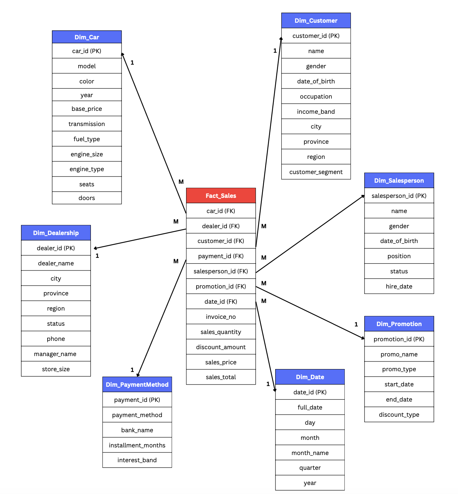

## Toyota Sales & Operations Data Warehouse
*(Data Warehouse & Analytics Project)*

📅 Duration: 01/2026 – Present  

---

### Overview  
This project focuses on designing a data warehouse to support sales and operations analysis. It transforms raw data into a structured format for reporting, KPI tracking, and business analysis.

---

### Data Model  

  

  <em>Star schema for sales and operations analysis, with a central fact table connected to key dimensions such as customer, product, dealership, and date</em>

---

### Key Features  
- Analyzed business requirements for sales and operations reporting  
- Defined KPIs such as **sales revenue and order volume**  
- Designed a star schema with a clearly defined fact table grain  
- Created dimension tables (Date, Product, Customer, Location)  
- Documented schema design using a data dictionary  

---

### Process  
1. Requirement analysis  
2. Data modeling (conceptual → logical)  
3. Schema design (star schema)  

---

### Technical Details  
- Identified fact table grain to ensure consistent data aggregation  
- Structured relationships between fact and dimension tables for efficient querying  
- Applied basic data warehousing principles (e.g., dimensional modeling)  
- Prepared schema for future BI dashboard integration  

---

### Project Status  
- Phase 1 completed (requirement analysis & dimensional design)  
- Phase 2 in progress (dashboard development & analytics)  

---

### Tools Used  
- SQL  
- Data Modeling  
- Data Warehousing Concepts  

---

### Project Structure  
- Data models  
- Documentation  
- SQL scripts (in progress)  
