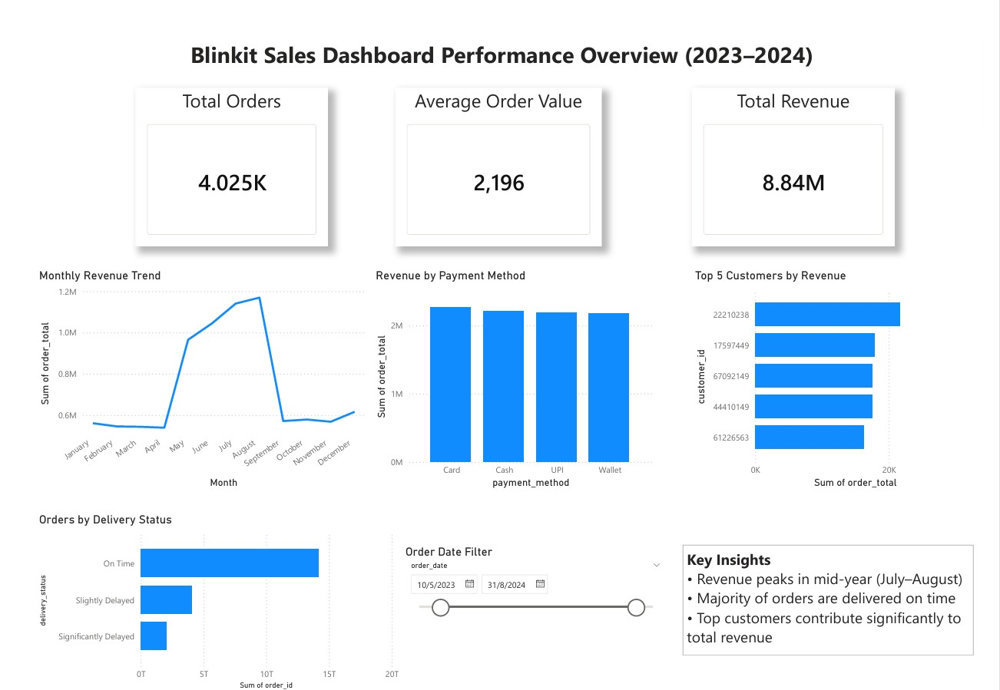

## Blinkit Sales Dashboard (Power BI)
*(Data Analytics & Visualization Project)*

📅 Duration: Mar 2026  

---

### Overview  
This project analyzes sales performance using an interactive Power BI dashboard. It transforms raw transactional data into meaningful insights to support business decision-making.

---

### Dashboard Preview  

  

  <em>Dashboard showing key KPIs, sales trends, and customer insights</em>

---

### Key Features  
- Developed an interactive dashboard to analyze sales and customer behavior  
- Defined key KPIs (Total Orders, Average Order Value, Total Revenue)  
- Analyzed monthly revenue trends to identify seasonal patterns  
- Built visualizations for delivery performance, payment methods, and customer segments  
- Enabled dynamic analysis using interactive filters (e.g., date range)

---

### Key Insights  
- Mid-year revenue peak indicates seasonal demand  
- Strong on-time delivery performance  
- Revenue concentrated among a small customer segment  

---

### Tools Used  
- Microsoft Power BI  
- Data Visualization  
- Data Analysis  

---

### Project Structure  
- Dashboard (.pbix file)  
- Dataset  
- Screenshots / Report  
