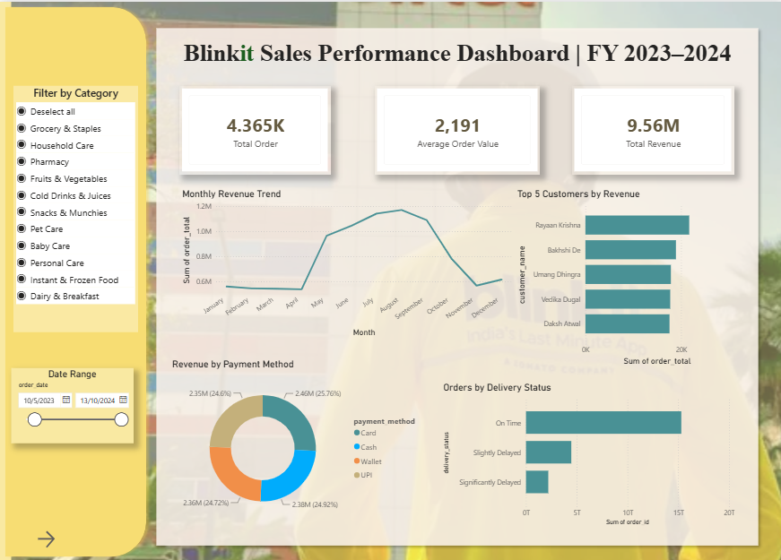

## Blinkit Sales Dashboard (Power BI)
*(Data Analytics & Visualization Project)*

📅 Duration: December 2025  

---

### Overview  
This project analyzes sales performance using an interactive Power BI dashboard. It transforms transactional data into clear insights to support business decision-making.  
It focuses on identifying trends, customer behavior, and operational performance.

---

### Dashboard Preview  

  

  <em>Dashboard displaying key KPIs, revenue trends, and customer insights</em>

---

### Key Features  
- Built an interactive dashboard to analyze **4,025 orders and 8.84M revenue**  
- Defined key KPIs including **Total Orders, Average Order Value, and Total Revenue**  
- Analyzed monthly revenue trends to identify seasonal patterns  
- Visualized delivery performance, payment methods, and customer segments  
- Enabled dynamic analysis through interactive filters (e.g., date range)

---

### Key Insights  
- Revenue peaks during mid-year, indicating seasonal demand patterns  
- Majority of orders are delivered on time  
- A small group of customers contributes a significant portion of total revenue  

---

### Technical Details  
- Cleaned and transformed data within Power BI (Power Query)  
- Created calculated measures using DAX (e.g., revenue aggregation, AOV)  
- Applied basic data modeling to structure relationships between tables  
- Designed visuals to highlight trends and support quick decision-making  

---

### Tools Used  
- Microsoft Power BI  
- Data Analysis & Visualization  

---

### Project Structure  
- Dashboard (.pbix file)  
- Dataset  
- Screenshots / Report  
